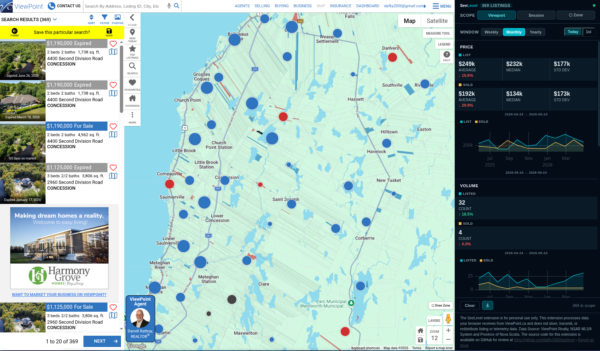

# SeeLevel


**The Nova Scotia market, on the level.** _View → See. Point → Level._
Perception meets a reference line.

SeeLevel is a Chrome side-panel extension that turns the listings you browse on
ViewPoint.ca into price, volume, days-on-market, list-to-sold and price-per-sqft
trends - a clear, calm read on the Nova Scotia market. Personal, non-commercial
use only.

On ViewPoint.ca it is a pure passive observer: every byte it processes is one
your browser was already going to fetch - and nothing more. No scraping, no
telemetry; close the side panel and the data is gone.

---

## What you'll see - The side panel



Five metric sections stacked in one scrolling view - Price, Volume, Days on
Market, Price/sqft, List → Sold %. Each section has headline stats (average,
median, std dev), an Active vs Sold split, and a uPlot time-series chart with
hover tooltips. Beneath Volume, a **price distribution** histogram shows how
many listings fall in each price band for the current window. Window picker at
the top: Weekly, Monthly, Yearly. Scope tabs across the header: **Viewport**
(what's on screen right now), **Session** (everything you've browsed this trip),
**Zone** (only listings inside a polygon you drew on the map). Works on
`viewpoint.ca/map`.

---

## Install

### From the Chrome Web Store (recommended)

**[Install SeeLevel from the Chrome Web Store](https://chromewebstore.google.com/detail/seelevel/pfgbjjnhgeeblcoflnijcdkkmhfmimif)**

Chrome handles installs and updates automatically. Once installed, visit
[viewpoint.ca/map](https://www.viewpoint.ca/map) and click the SeeLevel icon in
your toolbar. The side panel opens on the right.

### Download the prebuilt zip

1. Go to the
   [Releases page](https://github.com/dafky2000/seelevel/releases/latest) and
   download `seelevel-X.Y.Z.zip`.
2. Unzip it. You'll get a folder containing `manifest.json`.
3. In Chrome, open `chrome://extensions`.
4. Turn on **Developer mode** (top-right toggle).
5. Click **Load unpacked** and pick the unzipped folder.
6. Visit [viewpoint.ca/map](https://www.viewpoint.ca/map) and click the SeeLevel
   icon in your toolbar. The side panel opens on the right.

To update later: download the new zip, unzip on top of the old folder, and click
the refresh arrow on the SeeLevel card in `chrome://extensions`.

### Build and load it yourself

You need [Deno](https://deno.com/) installed. That's the only prerequisite.

1. Download the source:

   ```bash
   git clone https://github.com/dafky2000/seelevel
   cd seelevel
   ```

2. Build the extension:

   ```bash
   deno run -A build.ts
   ```

   This writes a `build/` folder.

3. Load the unpacked `build/` folder via the same Chrome steps 3-6 above.

Numbers fill in as ViewPoint loads listings - pan around, change filters, draw a
zone. To pick up future versions, run `deno run -A build.ts` again and click the
refresh arrow on the SeeLevel card in `chrome://extensions`.

---

## Features

- **📈 Five metrics, one scroll.** Price, Volume, Days on Market, Price/sqft,
  List → Sold % - stacked, not tabbed.
- **🗺️ Zone filtering.** The Zone tab lets you select any Nova Scotia town,
  district, county, or regional municipality from a grouped dropdown — SeeLevel
  pans the map there and applies the boundary as the active filter. Or draw a
  custom polygon on the map. Either way, every metric filters to the shape.
- **📊 Real charts.** uPlot time-series with monthly buckets, hover tooltip,
  configurable date windows, split Active / Sold series.
- **📊 Price distribution.** A histogram of how many listings sit in each price
  band for the current window - evenly binned under $1M (minimum
  $25k wide), with
  "$1M+", "$2M+", and "$5M+" tail buckets so a lone outlier doesn't flatten it.
- **🎯 Zone coverage.** A progress bar tells you how much of your drawn zone
  you've actually visited, so the numbers are never silently extrapolated.
- **↓ Export CSV.** Aggregated buckets only, with a <5-listing floor and an
  attribution header. Never raw rows.
- **📑 Per-tab state.** Two ViewPoint tabs don't cross-pollute. Open the panel
  late and the relay replays everything it buffered.

---

## Build and package

```bash
deno run -A build.ts             # dev build → build/ (inline sourcemaps)
deno run -A build.ts --prod      # production build (minified, no sourcemaps)
deno run -A build.ts --package   # production + zip → seelevel-X.Y.Z.zip
```

`--package` produces the exact zip that gets uploaded to the Chrome Web Store
(Google signs it on upload - there is no local `.crx` and no signing key to
manage).

The committed `src/panel/data/ns-municipalities.json` means normal, `--prod`,
and `--package` builds are offline and need no secrets. To regenerate the
boundary data (49 NS municipalities from the provincial open-data portal):

```bash
# Requires SOCRATA_API_KEY and SOCRATA_API_SECRET in a .env file.
deno run -A build.ts --refresh-boundaries
```

This re-fetches Socrata view `7bqh-hssn`, RDP-simplifies the geometries via
`scripts/boundaries/`, and overwrites `src/panel/data/ns-municipalities.json`.
Commit the result if the upstream data has changed.

Tests live under `src/panel/lib/__tests__/` and run with `deno test -A src/`.

### Releasing

Releases are tag-driven and handled by
[`.github/workflows/release.yml`](.github/workflows/release.yml). Two files are
the source of truth, and both must agree with the git tag:

- `manifest.json` -> `version` field (drives the build artifact name).
- `CHANGELOG.md` -> a `## [vX.Y.Z]` section (drives the release body).

The workflow validates both before publishing anything.

```bash
# 1. Bump the version in manifest.json.
# 2. Add a matching ## [vX.Y.Z] - YYYY-MM-DD section to CHANGELOG.md.
# 3. Commit both on main.
# 4. Tag and push:
git tag "v$(jq -r .version manifest.json)"
git push --tags
```

The workflow then validates the tag against `manifest.json`, extracts the
matching section from `CHANGELOG.md` as the release body, runs tests, builds
with `--package`, and creates a GitHub Release with the `seelevel-X.Y.Z.zip`
attached. The
[Releases page](https://github.com/dafky2000/seelevel/releases/latest) is what
the install section above links to.

Every push to `main` and every PR also runs
[`.github/workflows/ci.yml`](.github/workflows/ci.yml) - same toolchain the
release workflow uses, so a green CI run on `main` means the next tag will
release cleanly.

---

## How it works

```
viewpoint.ca/map                                  Extension
─────────────────                                 ─────────
[XHR /api/v2/listing/search] ─┐                   ┌──────────────┐
                              │                   │ background   │
[google.maps.Map ctor]  ──────┤  CustomEvent      │ service      │
                              │  on document      │ worker       │
                              ▼                   │ (port        │
        fetch-interceptor.ts                      │  broker)     │
        (MAIN world,                              └──────┬───────┘
         no chrome.* access)                             │ chrome.runtime
                              │     port               │ .connect
                              ▼     "relay"              ▼ port "panel"
        relay.ts  ────────────────────────────────► ┌──────────────┐
        (ISOLATED world,                            │  side panel  │
         owns the geofence                          │ (Preact +    │
         overlay too)                               │  uPlot)      │
                                                    └──────────────┘
```

Four little execution contexts, one direction of flow. Every cross-context
message rides one of two long-lived ports brokered through the service worker -
no `chrome.runtime.sendMessage` broadcasts, no `chrome.tabs.sendMessage`. That's
how the manifest gets away with just `sidePanel`.

---

## Methods and why

The load-bearing implementation choices, lifted from the initial commit message:

- **XHR interception over `fetch`.** ViewPoint's listing endpoints use
  `XMLHttpRequest`, so hooking `fetch` catches nothing in practice.
- **Patch the `google.maps.Map` constructor** (with a DOM-scan fallback for the
  race where ViewPoint constructs the map before our patch lands). There is no
  reliable Map back-reference in the DOM, and a constructor patch is the only
  stable way to obtain an instance to attach `idle` / `bounds_changed` /
  `zoom_changed` listeners to.
- **Drag-only mid-pan sync via `requestAnimationFrame`.** On zoom, hide the
  overlay immediately and re-sync once Google Maps fires `idle`. This keeps the
  overlay glued to the map without re-aggregating ~60×/sec.
- **Session = buffered upsert by id, keyed off ViewPoint mode switches.**
  Revisiting a listing refreshes it instead of duplicating it.
- **Deno-only tooling and runtime.** No Node, no `package-lock` churn, and the
  same npm specifiers resolve at build and typecheck time.

---

## Permissions

| Permission  | Why             |
| ----------- | --------------- |
| `sidePanel` | The UI surface. |

That's the entire `permissions` list. No `host_permissions` key either. Access
to the site is granted by `content_scripts.matches` (`*://*.viewpoint.ca/map*`),
which is the same install-time UX as `host_permissions` would be ("Read and
modify data on this site") but doesn't trigger Chrome Web Store's "Limited Host
Use" in-depth review path.

Notably absent: `activeTab`, `storage`, `tabs`, `scripting`, `webRequest`,
`cookies`, `<all_urls>`. The Chrome Web Store review surface is deliberately
tiny.

How this is possible:

- **No `activeTab` / `tabs` / `host_permissions`:** all cross-context messaging
  rides `chrome.runtime.connect` ports brokered through the service worker. None
  of those require host access.
- **No `storage`:** nothing is persisted. The EULA acknowledgement is
  per-session (`useState(false)` in the panel, reset on every mount). Listing
  data lives in Preact memory only.

---

## Repo layout

```
src/
  content/       fetch-interceptor.ts  ← MAIN world (no chrome.*)
                 relay.ts              ← ISOLATED world
                 geofence-overlay.ts   ← Leaflet + Geoman overlay on the map
  background/    sw.ts                 ← MV3 service worker (thin router)
  panel/
    App.tsx, components/, lib/         ← Preact + uPlot side panel
    lib/__tests__/                     ← pure-function unit tests
  types.ts                             ← shared types across all four contexts
manifest.json   build.ts   icons/   BRAND.md
```

Pure logic (aggregate, bucket, coverage, geofence, parse) lives in
`src/panel/lib/` and is unit-tested with `jsr:@std/assert`.

For architectural detail beyond what's here, see [`CLAUDE.md`](CLAUDE.md)
(orientation for code agents) and
[`docs/superpowers/specs/`](docs/superpowers/specs/) (the original design spec).

---

## Respect for the sites

This extension is built as a passive observer of data the browser already
received. It is not a scraper and not a crawler. On ViewPoint it makes no
requests of its own. The specific cautions baked into the code:

- **Read-only XHR observation.** `open` and `send` are wrapped, but arguments
  are forwarded verbatim. The patches are wrapped in try/catch so a bug here can
  never block or modify a request, and response reading is deferred via
  `setTimeout(…, 0)` so the page's own load handlers run to completion before we
  touch anything. Patched functions also mask `name` / `length` / `toString` to
  mirror the native originals - we don't want to look like we're tampering.
- **ViewPoint: no request generation.** On viewpoint.ca the extension never
  issues XHR or fetch to ViewPoint endpoints. Every byte it processes is one the
  user's browser was already going to fetch as part of normal browsing.
- **Non-2xx responses are dropped.** The HTTP 400 "Too many search results"
  error returned when the map is zoomed too far out is never treated as
  listings, so its bbox can't falsely count toward zone coverage.
- **No data persistence or transmission.** Listing and telemetry data live only
  in the panel's in-memory store for the life of the tab. Nothing is written to
  disk, sent off-device, or shared. The extension does not use `chrome.storage`
  at all - the EULA is acknowledged per session in plain React state.
- **Personal use only.** The manifest description, EULA gate, and panel
  disclaimer all state plainly that the tool is for personal, non-commercial
  use, and instruct professional users to contact ViewPoint directly before
  using ViewPoint.ca's tools and data.
- **Attribution.** The disclaimer credits the data source: ViewPoint Realty,
  NSAR MLS® System, and the Province of Nova Scotia.
- **Open source for audit.** The full source is public here so ViewPoint and any
  interested party can verify the above claims.

---

## Why SeeLevel exists - and why it can

[Bill McMullin](http://www.mcmullin.ca/about) and TrueCheck partner Mike Cairns
launched [ViewPoint.ca](https://www.viewpoint.ca/) in **January 2010**. When
they tried to publish what buyers and sellers actually want - property _sale_
prices - the Province of Nova Scotia refused under the Freedom of Information
and Protection of Privacy Act, citing homeowner privacy. At the same time, they
had already sold that data to an Ontario corporation. With Garth Turner
amplifying the absurdity in public, McMullin pushed the legislature, and in
**May 2012** the House passed
**[Bill 73](https://nslegislature.ca/legc/bills/61st_4th/1st_read/b073.htm)**,
making property sale and transfer information a public record. Nova Scotia
became - and remains - the only province in Canada where both the real-estate
board (NSAR) and the provincial government publish listing and property data.
That fight is the only reason a tool like SeeLevel can exist at all.

So: to **Bill McMullin**, to **Mike Cairns**, to **Garth Turner**, to every MLA
who voted for Bill 73, and to the entire **ViewPoint Realty team** who have kept
the front door open and the data legible ever since - thank you. SeeLevel is a
love letter from a curious neighbour, not a substitute for what you've built.

> **Data source:** ViewPoint.ca - listing data licensed from the Nova Scotia
> Association of REALTORS® (NSAR) MLS® System. Property assessment and boundary
> data © Province of Nova Scotia. This tool processes data received during your
> personal ViewPoint.ca browsing session. It does not store, copy, or
> redistribute MLS® data.

---

## License and use

Personal, non-commercial use only. If you use ViewPoint.ca in the course of
commercial or professional work, [contact ViewPoint](https://www.viewpoint.ca/)
directly before using data-augmenting tools - that's their ask, not mine.

Found a bug? File one against
[`dafky2000/seelevel`](https://github.com/dafky2000/seelevel/issues/new). The
panel's footer has a "Report an issue" link that pre-fills the extension version
for you.

_SeeLevel - the Nova Scotia market, on the level._
